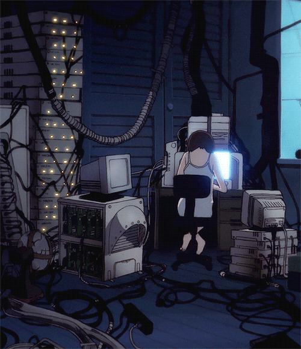

<div align="center">

# DANIEL

### `IT • CYBERSECURITY • LINUX • PYTHON`



</div>

---

## `> whoami`

I'm an **ADS student** and **IT Support intern** focused on **cybersecurity, systems and software development**.

I'm currently building security-oriented applications
in Python, exploring malware analysis, OSINT, automation
and security tooling while strengthening my foundations
in Linux and computer systems.

```text
$ cat focus.txt

PRIMARY FOCUS
> Cybersecurity

DEVELOPMENT
> Python
> Security Tooling
> Automation

FOUNDATIONS
> Linux
> Networking
> Computer Systems
```

---

## `> stack`

### Languages & Development


### Systems & Infrastructure


### Security Tooling


---

## `> currently_learning`

```text
┌──────────────────────────────────────────────┐
│                                              │
│  CYBERSECURITY                               │
│  └─ security fundamentals · malware analysis│
│                                              │
│  PYTHON                                      │
│  └─ automation · tooling · security apps    │
│                                              │
│  OSINT                                       │
│  └─ reconnaissance · username research      │
│                                              │
│  LINUX                                      │
│  └─ systems · processes · filesystem        │
│                                              │
│  SOFTWARE ENGINEERING                        │
│  └─ architecture · APIs · CLI · GUI         │
│                                              │
└──────────────────────────────────────────────┘
```

---

## `> projects`

### [`01 / CERBERUS`](https://github.com/shwdaniel7/CERBERUS)

**Static Malware Analysis Toolkit**

Python-based toolkit designed to inspect suspicious files before execution.

```text
SHA-256          → fingerprinting
IOC Database     → local blacklist checks
VirusTotal       → reputation lookup
String Analysis  → suspicious IOC extraction
Entropy          → Shannon entropy assessment
Magic Bytes      → file-type validation
JSON Reports     → structured scan results
```

**Python · VirusTotal API · Tkinter · JSON**

> Built to explore malware analysis, file inspection and security tooling.

---

### [`02 / FLCL`](https://github.com/shwdaniel7/FLCL-File-Organizer)

**File Logical Classifier Launcher**

A desktop application that automatically organizes files based on their
extensions, with real-time folder monitoring.

```text
Initial Scan       → organize existing files
Real-Time Watch    → detect new files
Custom Rules       → configurable file organization
Standalone App     → packaged with PyInstaller
Themed Interface   → custom GUI with animated visuals
```

**Python · CustomTkinter · Pillow · Watchdog · PyInstaller**

> A desktop automation tool with a custom FLCL-inspired interface.

---

## `> github`

<div align="center">

[](https://github-stats-extended.vercel.app/api?username=shwdaniel7&show_icons=true&include_all_commits=true&theme=gruvbox)

</div>


---

## `> contact`

<div align="center">

[LinkedIn](https://www.linkedin.com/in/daniel-silva-santos-b85012305/) · [Email](mailto:oficialdansilva@gmail.com)

<br>

`wired.`

</div>
